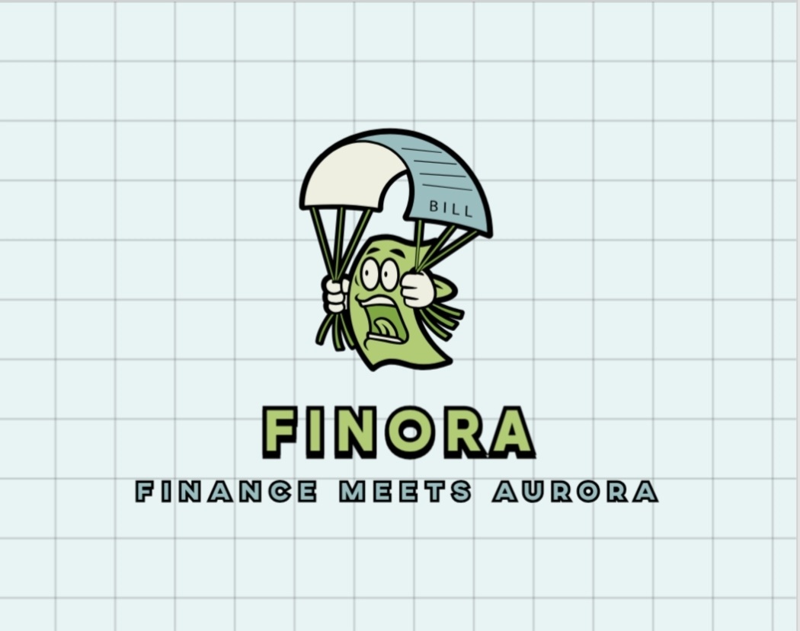

<p align="center">
  
</p>

<h1 align="center">FINORA</h1>

<p align="center"><b>Finance Meets Aurora</b></p>

<p align="center">
  A real-time financial transaction monitoring platform powered by 
  <br/>Spring Boot, Kafka, Prometheus, Grafana, and Elasticsearch.
</p>

---


## 1. Overview
Finora는 **거래 이벤트 모니터링 플랫폼**입니다.  
계좌·거래 CRUD를 기반으로 Kafka 이벤트 스트리밍, Prometheus/Grafana를 통한 실시간 지표 관측, Elasticsearch 기반 검색/집계 기능을 제공합니다.  
추가로 금융 서비스 신뢰성 확보를 위해 **이상 거래 탐지**와 **보상 거래 시뮬레이션**을 라이트 버전으로 시연합니다.


## 2. Features
- **CRUD API**
  - Account/Transaction 생성·조회
  - Validation & 예외 처리
- **Event Streaming**
  - 거래 생성 시 Kafka 이벤트 발행
  - Consumer가 이벤트를 DB와 Elasticsearch에 반영
- **Monitoring**
  - Micrometer → Prometheus → Grafana
  - 거래 성공률, 지연(p95/p99), Kafka consumer lag 시각화
- **Search & Analytics**
  - Elasticsearch 기반 조건 검색
  - 거래 집계(시간대별, 금액 구간별, 유형 분포)
- **(선택) Anomaly Detection**
  - 룰 기반 이상 거래 탐지 및 알림(Alert) 발행
- **(선택) Compensation**
  - 실패 거래 발생 시 보상 거래(Compensation) 생성 시뮬레이션


## 3. Architecture
```mermaid
flowchart LR
  User[Client] --> API[Core API]
  API -->|Tx Events| Kafka
  Kafka --> Ingestor
  Ingestor --> DB[(PostgreSQL)]
  Ingestor --> ES[(Elasticsearch)]
  ES --> SearchAPI
  API -->|Metrics| Prometheus
  Prometheus --> Grafana
  subgraph Optional
    Kafka --> AnomalyWorker --> AlertsDB[(Alerts)]
    Kafka --> Compensator
  end
````
- **Ingestor** (수집기): Kafka에서 발행된 이벤트를 “받아들이고” 필요한 저장소(DB/ES)에 반영
- **Compensator** (보상 처리기): 거래가 실패했을 때 되돌리거나 맞춰줌
- **Prometheus** (수집&저장): 애플리케이션에서 보이는 지표(Metrics) 수집하여 시계열 DB에 저장
- **Grafana** (시각화&대시보드): 가져온 시계열 데이터 시각화

## 4. Tech Stack

* **Backend**: Java 17, Spring Boot 3, Spring Data JPA
* **Messaging**: Apache Kafka
* **Database**: PostgreSQL
* **Search**: Elasticsearch (or OpenSearch)
* **Monitoring**: Micrometer, Prometheus, Grafana
* **Infra**: Docker Compose, Testcontainers (for integration tests)
* **PostgreSQL**: 정합성을 보장하는 "정식 원장"
* Elasticsearch: 거래 데이터를 검색/분석하기 위한 보조 저장소


## 5. Project Structure

```
/finora
  /core-api
  /ingestor
  /search-api
  /anomaly-worker (optional)
  /compensator (optional)
  /infra
  /schemas
  /scripts
  /docs
```


## 6. Getting Started

```bash
# clone repository
git clone https://github.com/username/finora.git
cd finora

# run infra (Kafka, PostgreSQL, ES, Prometheus, Grafana)
docker-compose up -d

# run core-api
./gradlew :core-api:bootRun
```


## 7. Roadmap

* [ ] 1주차: 레포/Notion 세팅, 코드 컨벤션, README, UI 레퍼런스 수집
* [ ] 2주차: 프론트앤드 개발, API/ERD 설계
* [ ] 3–4주차: CRUD API + Micrometer 기초 관측
* [ ] 5–6주차: Kafka 이벤트 발행/소비 + DB/ES 연동
* [ ] 7–8주차: 검색 API + Grafana 대시보드 고도화
* [ ] 9주차: 이상 탐지(룰 기반 Alert)
* [ ] 10주차: 보상 거래 시뮬레이션 + 문서화


## 8. References

* [Prometheus Docs](https://prometheus.io/docs/introduction/overview/)
* [Grafana Docs](https://grafana.com/docs/)
* [Kafka Documentation](https://kafka.apache.org/documentation/)
