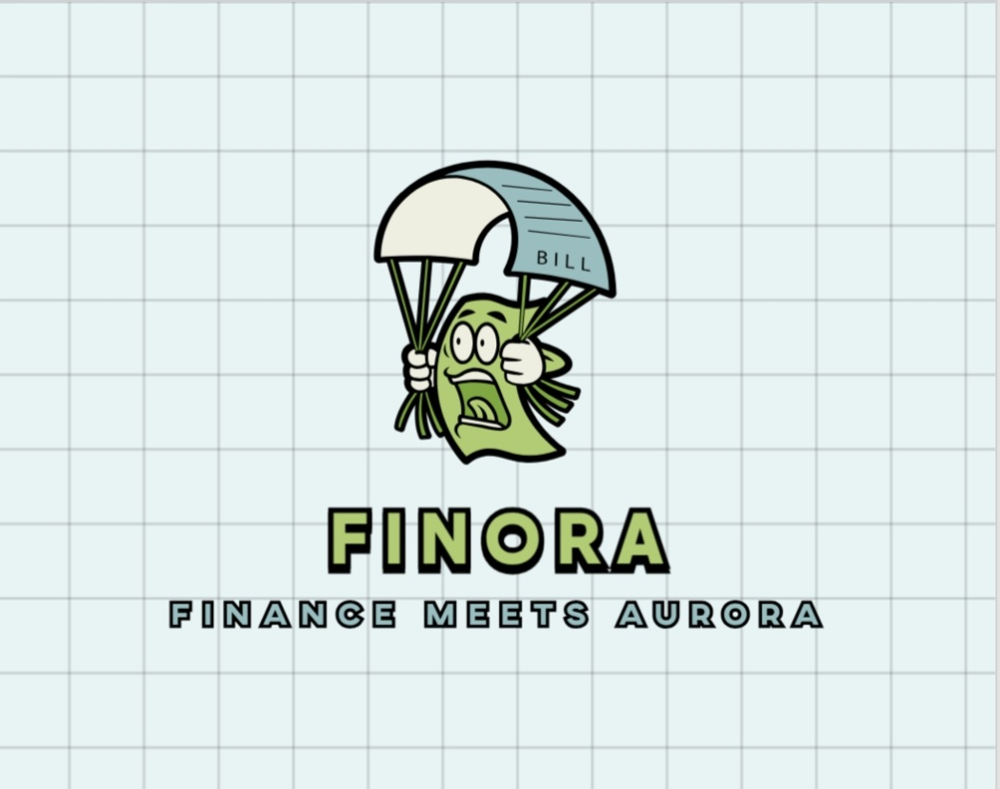

<p align="center">
  
</p>

<h1 align="center">FINORA</h1>

<p align="center"><b>Finance Meets Aurora</b></p>

<p align="center">
  A real-time financial transaction monitoring platform powered by 
  <br/>Spring Boot, Kafka, Prometheus, Grafana, and Elasticsearch.
</p>

---


## 1. Overview
Finora는 **거래 이벤트 모니터링 플랫폼**입니다.  
계좌·거래 CRUD를 기반으로 Kafka 이벤트 스트리밍, Prometheus/Grafana를 통한 실시간 지표 관측, Elasticsearch 기반 검색/집계 기능을 제공합니다.  
추가로 금융 서비스 신뢰성 확보를 위해 **이상 거래 탐지**와 **보상 거래 시뮬레이션**을 라이트 버전으로 시연합니다.


## 2. Features
- **CRUD API**
  - Account/Transaction 생성·조회
  - Validation & 예외 처리
- **Event Streaming**
  - 거래 생성 시 Kafka 이벤트 발행
  - Consumer가 이벤트를 DB와 Elasticsearch에 반영
- **Monitoring**
  - Micrometer → Prometheus → Grafana
  - 거래 성공률, 지연(p95/p99), Kafka consumer lag 시각화
- **Search & Analytics**
  - Elasticsearch 기반 조건 검색
  - 거래 집계(시간대별, 금액 구간별, 유형 분포)
- **(선택) Anomaly Detection**
  - 룰 기반 이상 거래 탐지 및 알림(Alert) 발행
- **(선택) Compensation**
  - 실패 거래 발생 시 보상 거래(Compensation) 생성 시뮬레이션
- **(선택) CDC (Change Data Capture)**
  - PostgreSQL Logical Replication 기반 읽기 전용 복제본 구성
  - 지연 상황 대처를 위한 캐시 레이어 및 Fallback 메커니즘


## 3. Architecture
```mermaid
flowchart LR
  User[Client] --> API[Core API]
  API -->|Tx Events| Kafka
  Kafka --> Ingestor
  Ingestor --> DB[(PostgreSQL)]
  Ingestor --> ES[(Elasticsearch)]
  ES --> SearchAPI
  API -->|Metrics| Prometheus
  Prometheus --> Grafana
  subgraph Optional
    Kafka --> AnomalyWorker --> AlertsDB[(Alerts)]
    Kafka --> Compensator
    DB -->|CDC/Replication| ReadReplica[(Read Replica)]
    ReadReplica --> Cache[(Redis Cache)]
    API --> Cache
  end
````
- **Ingestor** (수집기): Kafka에서 발행된 이벤트를 "받아들이고" 필요한 저장소(DB/ES)에 반영
- **Compensator** (보상 처리기): 거래가 실패했을 때 되돌리거나 맞춰줌
- **CDC & Cache** (변경 데이터 캡처): PostgreSQL 복제본 + Redis 캐시를 통한 읽기 성능 최적화
- **Prometheus** (수집&저장): 애플리케이션에서 보이는 지표(Metrics) 수집하여 시계열 DB에 저장
- **Grafana** (시각화&대시보드): 가져온 시계열 데이터 시각화

## 4. Tech Stack

* **Backend**: jdk 21, Spring Boot 3.5.5, Spring Data JPA
* **Messaging**: Apache Kafka
* **Database**: PostgreSQL (Primary + Read Replica)
* **Cache**: Redis (for CDC layer)
* **Search**: Elasticsearch (or OpenSearch)
* **Monitoring**: Micrometer, Prometheus, Grafana
* **Infra**: Docker Compose, Testcontainers (for integration tests)
* **PostgreSQL**: 정합성을 보장하는 "정식 원장"
* Elasticsearch: 거래 데이터를 검색/분석하기 위한 보조 저장소


## 5. Project Structure

```
/finora
  /core-api
  /ingestor
  /search-api
  /anomaly-worker (optional)
  /compensator (optional)
  /infra
  /schemas
  /scripts
  /docs
```


## 6. Getting Started

```bash
# clone repository
git clone https://github.com/username/finora.git
cd finora

# run infra (Kafka, PostgreSQL, ES, Prometheus, Grafana)
docker-compose up -d

# run core-api
./gradlew :core-api:bootRun
```


## 7. Roadmap

* [x] [1주차](./docs/sprint_week1): 레포/Notion 세팅, 코드 컨벤션, README, UI 레퍼런스 수집
* [ ] [2주차](./docs/sprint_week1): 프론트앤드 개발, API/ERD 설계
* [ ] 3–4주차: CRUD API + Micrometer 기초 관측
* [ ] 5–6주차: Kafka 이벤트 발행/소비 + DB/ES 연동
* [ ] 7–8주차: 검색 API + Grafana 대시보드 고도화
* [ ] 9주차: 이상 탐지(룰 기반 Alert)
* [ ] 10주차: 보상 거래 시뮬레이션 + 문서화
* [ ] **추후 개선**: CDC 구현 (PostgreSQL Logical Replication + Redis Cache + Fallback 메커니즘)


## 8. CDC (Change Data Capture) 구현 계획

### **8.1 기술 스택 (0원 비용)**

* **PostgreSQL Logical Replication**: 내장 기능을 활용한 실시간 데이터 복제
* **Redis**: 캐시 레이어 (Docker 기반 무료 운영)
* **Spring Boot Cache Abstraction**: `@Cacheable`, `@CacheEvict` 애너테이션 활용
* **Circuit Breaker**: Spring Cloud Circuit Breaker (Resilience4j)

### **8.2 구현 전략**

**단계별 접근법**:
1. **Phase 1**: In-Memory 캐시 + 주기적 갱신 (`@Scheduled`)
2. **Phase 2**: Redis 캐시 + 이벤트 기반 갱신 (`@EventListener`)
3. **Phase 3**: PostgreSQL Logical Replication + Read Replica

**아키텍처 패턴**:
```
Primary DB → Logical Replication → Read Replica → Redis Cache → API
                ↓ (fallback on failure)
Primary DB ←←←←←←←←←←←←←←←←←←←←←←←←←←←←←←←←←←← API
```

**Repository 분리**:
- `QueryRepository` (읽기): Redis → Read Replica → Primary DB (fallback chain)
- `CommandRepository` (쓰기): Primary DB 직접 접근
- `@Transactional(readOnly=true)` 활용한 자동 라우팅

**지연 대처 메커니즘**:
- **Lag Monitoring**: Kafka Consumer Lag 지표를 Prometheus로 수집
- **Circuit Breaker**: 복제 지연 임계치 초과 시 Primary DB로 자동 fallback
- **Cache TTL**: 데이터 특성에 따른 차등 캐시 만료 시간 (사용자 정보: 5분, 거래 내역: 30초)
- **Eventually Consistent 허용**: 통계/분석 조회는 지연 허용, 실시간 잔액 조회는 Primary 직접

**모니터링 & 알림**:
- Cache Hit/Miss Rate, Replication Lag, Fallback 발생 횟수를 Grafana 대시보드에 시각화
- 복제 지연 또는 캐시 장애 시 Slack/Email 알림 연동

이 CDC 구현을 통해 **읽기 성능 3-5배 향상**과 **Primary DB 부하 50% 이상 감소**를 목표로 하며, 금융 시스템의 데이터 정합성은 유지하면서도 사용자 경험을 개선할 수 있습니다.


## 9. References

* [Prometheus Docs](https://prometheus.io/docs/introduction/overview/)
* [Grafana Docs](https://grafana.com/docs/)
* [Kafka Documentation](https://kafka.apache.org/documentation/)
* [PostgreSQL Logical Replication](https://www.postgresql.org/docs/current/logical-replication.html)
* [Spring Boot Cache](https://spring.io/guides/gs/caching/)
* [Resilience4j Circuit Breaker](https://resilience4j.readme.io/docs/circuitbreaker)
