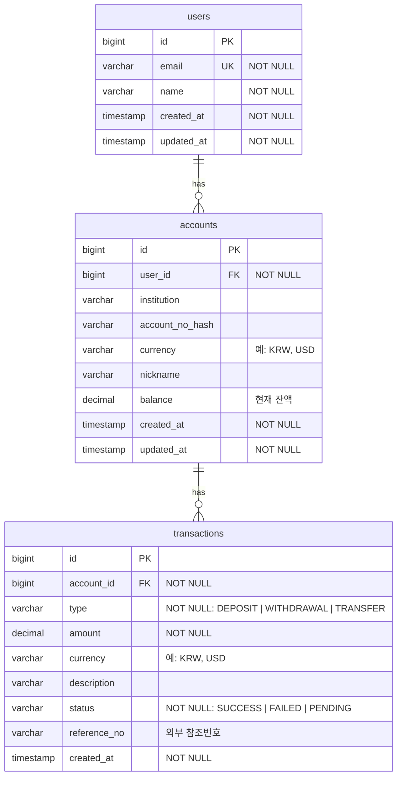

# Finora ERD

> 최초 작성: 2026-02-23
> 대상 범위: Core API — User / Account / Transaction

---

## 테이블 관계

---

## 테이블 상세

### users

| 컬럼 | 타입 | 제약 | 설명 |
|------|------|------|------|
| id | BIGINT | PK, AUTO_INCREMENT | 식별자 |
| email | VARCHAR(255) | NOT NULL, UNIQUE | 이메일 (로그인 식별자) |
| name | VARCHAR(100) | NOT NULL | 사용자 이름 |
| created_at | TIMESTAMP | NOT NULL | 생성일시 |
| updated_at | TIMESTAMP | NOT NULL | 수정일시 |

---

### accounts

| 컬럼 | 타입 | 제약 | 설명 |
|------|------|------|------|
| id | BIGINT | PK, AUTO_INCREMENT | 식별자 |
| user_id | BIGINT | NOT NULL, FK → users.id | 소유자 |
| institution | VARCHAR(100) | | 금융 기관명 (예: KB, 신한) |
| account_no_hash | VARCHAR(255) | | 계좌번호 해시값 (원문 미저장) |
| currency | VARCHAR(10) | | 통화 코드 (예: KRW, USD) |
| nickname | VARCHAR(100) | | 계좌 별명 |
| balance | DECIMAL(19,4) | | 현재 잔액 |
| created_at | TIMESTAMP | NOT NULL | 생성일시 |
| updated_at | TIMESTAMP | NOT NULL | 수정일시 |

---

### transactions

| 컬럼 | 타입 | 제약 | 설명 |
|------|------|------|------|
| id | BIGINT | PK, AUTO_INCREMENT | 식별자 |
| account_id | BIGINT | NOT NULL, FK → accounts.id | 대상 계좌 |
| type | VARCHAR(20) | NOT NULL | 거래 유형: `DEPOSIT` / `WITHDRAWAL` / `TRANSFER` |
| amount | DECIMAL(19,4) | NOT NULL | 거래 금액 |
| currency | VARCHAR(10) | | 통화 코드 |
| description | VARCHAR(255) | | 거래 설명 |
| status | VARCHAR(20) | NOT NULL | 처리 상태: `SUCCESS` / `FAILED` / `PENDING` |
| reference_no | VARCHAR(100) | | 외부 시스템 참조번호 |
| created_at | TIMESTAMP | NOT NULL | 거래 발생일시 |

> `transactions`에는 `updated_at`을 두지 않는다. 거래는 생성 후 수정하지 않으며, 상태 변경이 필요한 경우 별도 이벤트로 처리한다.

---

## 설계 결정 메모

- **계좌번호 해시 저장**: 원문 계좌번호는 저장하지 않고 해시값만 보관 (보안)
- **balance 위치**: 거래 발생 시 Account.balance를 업데이트. Kafka 이벤트로 비동기 반영 예정
- **Transaction 불변성**: 거래 레코드는 생성 후 수정하지 않음 (audit 목적)
- **audit 필드**: `@EntityListeners(AuditingEntityListener.class)` + `@CreatedDate` / `@LastModifiedDate` 로 자동 관리 예정
